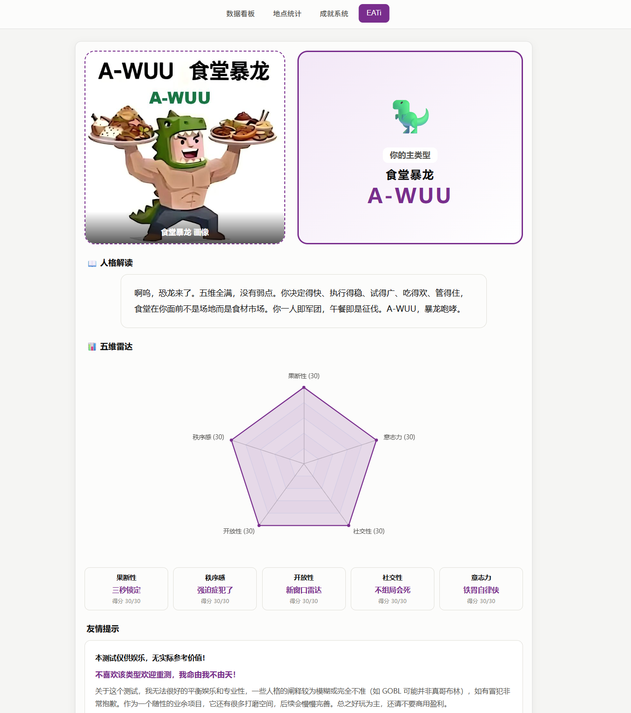

# 🍜 EATi — 你的食堂人格是什么？

30 道情境题 · 五维解码 · 21 种食堂人格

👉 **[开始测试](https://user-A100.github.io/EATi)**

---



## 这是什么

EATi（Eating Appetite Type Indicator）是开发 [THU Eat](https://github.com/user-A100/THU-EAT)（清华校园卡消费统计）时顺手做出来的一个性格测试。

原本内嵌在 THU Eat 里，需要导入校园卡数据才能解锁。但测试本身挺好玩——不管是不是清华学生、有没有校园卡，都可以测。于是单独拆了出来，整理成一个 HTML 文件，**任何人都能用**。

仿照 MBTI 的五维人格模型：果断性、秩序感、开放性、社交性、意志力。30 题答完，匹配 18 种基础人格 + 3 种隐藏人格。

纯前端计算，不上传任何数据。双击 `index.html` 就能玩。

## 怎么用

**🏠 推荐：直接点链接 → [https://user-A100.github.io/EATi](https://user-A100.github.io/EATi)**

啥都不用装，浏览器打开就能测。

<details>
<summary>或者下载到本地</summary>

```bash
git clone https://github.com/user-A100/EATi.git
cd EATi && open index.html
```

</details>

## License

MIT
